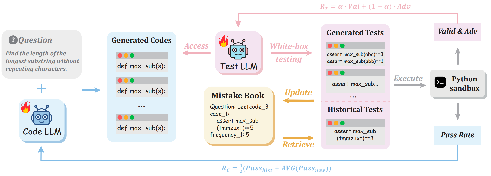
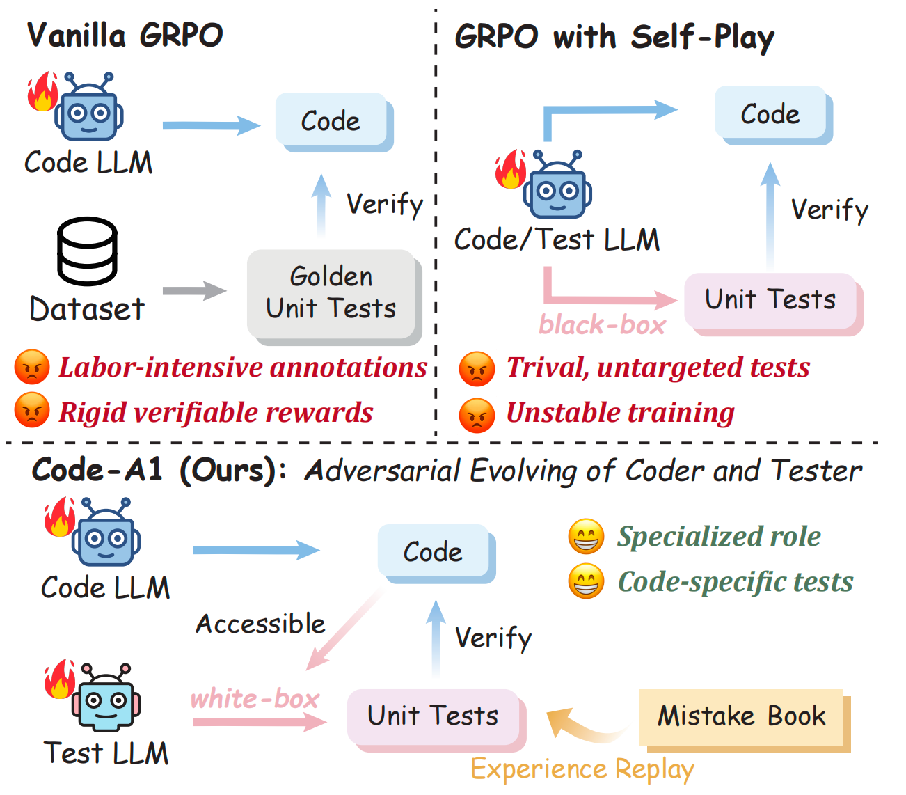

<div align="center">

<h1>Code-A1: Adversarial Evolving of Code LLM and Test LLM via Reinforcement Learning</h1>

<p><em>An adversarial co-evolution framework that jointly optimizes a Code LLM and a Test LLM for code reinforcement learning.</em></p>

[]()
[](https://zju-real.github.io/Code-A1)

</div>

<br>

<div align="center">
  
  <p><em>Code-A1 jointly trains a Code LLM and a Test LLM with opposing objectives, enables white-box adversarial test generation without self-collusion, and uses a Mistake Book replay mechanism to retain and revisit historical failure cases.</em></p>
</div>

## Table of Contents

- [Motivation](#motivation)
- [Highlights](#highlights)
- [Repository Structure](#repository-structure)
- [Installation](#installation)
- [Dataset](#dataset)
- [Quick Start](#quick-start)
- [Main Results](#main-results)
- [Citation](#citation)
- [Acknowledgement](#acknowledgement)

## Motivation

Reinforcement learning for code generation typically depends on unit-test pass rates as verifiable rewards. In practice, this creates three persistent issues:

- Static golden tests are limited in coverage and quickly saturate as the code model improves.
- Black-box generated tests are often too generic to expose implementation-specific bugs.
- Single-model self-play introduces self-collusion: the same model can generate easy tests that inflate rewards without improving code quality.

Code-A1 addresses this by separating the two roles. A **Code LLM** is optimized to solve programming problems, while a **Test LLM** is optimized to expose errors in the generated code. This makes white-box test generation useful rather than dangerous: the Test LLM can inspect candidate implementations and generate targeted adversarial tests. The framework further stabilizes co-evolution with a **Mistake Book** replay mechanism and a **composite reward** that balances test validity and adversarial difficulty.

<div align="center">
  
</div>

## ✨ Highlights

- **Adversarial co-evolution**: jointly optimizes a Code LLM and a Test LLM with opposite objectives instead of collapsing both roles into one model.
- **White-box test generation without self-collusion**: the Test LLM conditions on candidate code to synthesize implementation-specific attack tests.
- **Mistake Book replay**: historical failure cases are replayed during training so the Code LLM does not forget earlier weaknesses.
- **Composite reward for Test LLM**: balances executable test validity with adversarial difficulty.
- **Strong empirical gains**: improves both code generation and test generation, and generated tests can even serve as competitive static supervision.

## 🛠 Installation

The project uses **Python 3.10** and **uv** for environment management. The provided scripts create two separate environments: one for RL training and one for evaluation.

### 1. RL environment

```bash
cd Code-A1
bash rl_env.sh
source .venv-rl/bin/activate
```

This script creates `.venv-rl`, installs the local `verl` fork in editable mode, and installs the main runtime dependencies including `ray`, `vllm/sglang` support, and `sandbox_fusion`.

### 2. Evaluation environment

```bash
cd Code-A1
bash eval_env.sh
source .venv-eval/bin/activate
```

This script creates `.venv-eval` and installs the packages needed for BigCodeBench evaluation, mutation-based tooling, `vllm==0.11.0`, `wandb`, and `sandbox_fusion`.

### 3. Runtime prerequisites

Before training or evaluation, configure environment variables in `Code-A1/code/rl/run/set_env.sh`:

```bash
export SANDBOX_FUSION_ENDPOINT=YOUR_SANDBOX_IP
export WANDB_API_KEY=YOUR_WANDB_API_KEY
```

The training scripts also expect:

- A reachable `sandbox_fusion` service for secure code execution.
- GPUs compatible with the selected model scale and FSDP-based training.
- Access to the base models specified in the YAML configs, such as `Qwen/Qwen2.5-Coder-1.5B-Instruct`.

## 📊 Dataset

The training data is stored in `Code-A1/code/rl/train_data/kodcode_hard_dual_model_training_data_mix.parquet` and is built from **9,688 hard-difficulty questions from KodCode-V1**.

## 🚀 Quick Start

### Sandbox check

Validate that the sandbox executor is reachable before running training:

```bash
cd Code-A1
bash test_sandbox.sh
```

Expected output should contain a successful `RunCodeResponse` with `return_code=0`.

### RL training

Provided launch scripts:

```bash
cd Code-A1
source .venv-rl/bin/activate

bash code/rl/run/1.5B_A1.sh
bash code/rl/run/3B_A1.sh
bash code/rl/run/7B_A1.sh
```

For example, the default 1.5B config uses:

- `Qwen/Qwen2.5-Coder-1.5B-Instruct` as the Code LLM
- `Qwen/Qwen2.5-Coder-1.5B-Instruct` as the Test LLM
- `alpha: 0.5` in the composite test reward
- `n_gpus_per_node: 4` for both Code LLM and Test LLM
- `rollout.n: 8` during training and `n: 32` during validation sampling

### Evaluation

For the **Code LLM**:

- **HumanEval+** and **MBPP+** are included in the validation data and are evaluated during training.
- **BigCodeBench** is evaluated separately with:

```bash
cd Code-A1
source .venv-eval/bin/activate
bash code/rl/run/eval.sh
```

For the **Test LLM**, evaluation is conducted with [**UnLeakedTestBench**](https://github.com/huangd1999/UnLeakedTestBench)

## 📈 Main Results

### Code generation

Code-A1 outperforms both the Golden Tests baseline trained on human annotations and the Self-Play approach on HumanEval+, MBPP+, and BigCodeBench.

| Code LLM | Method | HumanEval+ | MBPP+ | BigCodeBench | Avg |
| - | - | -: | -: | -: | -: |
| Qwen2.5-Coder-1.5B-Instruct | Base | 63.42 | 60.87 | 29.34 | 51.21 |
| Qwen2.5-Coder-1.5B-Instruct | Golden Tests | 71.15 | 63.30 | 34.23 | 56.23 |
| Qwen2.5-Coder-1.5B-Instruct | Self-Play | 70.64 | 63.54 | 33.47 | 55.88 |
| Qwen2.5-Coder-1.5B-Instruct | **Code-A1** | **72.69** | 63.33 | **34.82** | **56.95** |
| Qwen2.5-Coder-3B-Instruct | Base | 77.63 | 63.12 | 41.78 | 60.84 |
| Qwen2.5-Coder-3B-Instruct | Golden Tests | 81.96 | 68.05 | 45.41 | 65.14 |
| Qwen2.5-Coder-3B-Instruct | Self-Play | 81.86 | 67.06 | 45.09 | 64.67 |
| Qwen2.5-Coder-3B-Instruct | **Code-A1** | **83.52** | **69.07** | **45.85** | **66.15** |
| Qwen2.5-Coder-7B-Instruct | Base | 83.69 | 71.95 | 49.41 | 68.35 |
| Qwen2.5-Coder-7B-Instruct | Golden Tests | 84.68 | 74.16 | 52.28 | 70.37 |
| Qwen2.5-Coder-7B-Instruct | Self-Play | 84.70 | 74.23 | 52.25 | 70.39 |
| Qwen2.5-Coder-7B-Instruct | **Code-A1** | **85.21** | **74.50** | **52.46** | **70.72** |

### Test generation

The Test LLM also improves substantially under adversarial co-evolution. Notably, the 3B Test LLM trained with Code-A1 reaches `Mul = 15.29`, exceeding the unoptimized 7B base model (`14.72`).

| Test LLM | Method | pass@5 | mut@5 | Mul |
| - | - | -: | -: | -: |
| Qwen2.5-Coder-1.5B-Instruct | Base | 16.29 | 22.30 | 3.63 |
| Qwen2.5-Coder-1.5B-Instruct | SFT | 14.76 | 29.45 | 4.35 |
| Qwen2.5-Coder-1.5B-Instruct | Self-Play | 23.39 | 28.91 | 6.76 |
| Qwen2.5-Coder-1.5B-Instruct | **Code-A1** | **27.05** | 26.41 | **7.14** |
| Qwen2.5-Coder-3B-Instruct | Base | 20.93 | 42.55 | 8.91 |
| Qwen2.5-Coder-3B-Instruct | SFT | 23.51 | 36.29 | 8.53 |
| Qwen2.5-Coder-3B-Instruct | Self-Play | 29.64 | 50.92 | 15.09 |
| Qwen2.5-Coder-3B-Instruct | **Code-A1** | **30.86** | 49.56 | **15.29** |
| Qwen2.5-Coder-7B-Instruct | Base | 28.73 | 51.25 | 14.72 |
| Qwen2.5-Coder-7B-Instruct | SFT | 28.72 | 50.85 | 14.60 |
| Qwen2.5-Coder-7B-Instruct | Self-Play | 35.13 | 55.57 | 19.52 |
| Qwen2.5-Coder-7B-Instruct | **Code-A1** | **37.15** | 53.14 | **19.74** |

## 📄 Citation

```bibtex
@misc{code-a1-2026,
  title={Code-A1: Adversarial Evolving of Code LLM and Test LLM via Reinforcement Learning},
  author={Anonymous Authors},
  year={2026},
  primaryClass={cs.CL}
}
```

## 🙏 Acknowledgement

The RL training stack is built on top of the excellent [verl](https://github.com/volcengine/verl) framework, which is included in this repository under `Code-A1/verl`. Many thanks to the verl team for open-sourcing the infrastructure that this project extends.
